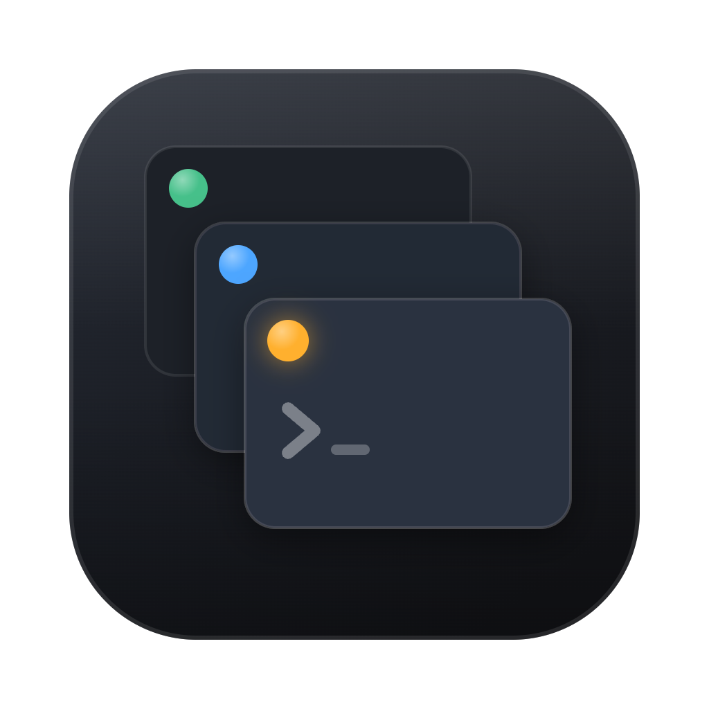

# CC HUD

macOS 悬浮 HUD：实时监控本机所有 Claude Code 会话(任意终端、任意窗口)。

[English](README.md) · 简体中文

## 功能

- **状态一目了然** —— 等待权限(含待批命令)/ 工作中(当前活动 + 计时)/ 空闲 / 无响应。
- **用量** —— 每会话上下文用量%;账户级 5h / 7d 配额 + 重置倒计时;今日 token 总量。
- **点击跳转** —— 点会话行即跳转到它所在的终端窗口(iTerm2 / Terminal 精确到 tab,Ghostty 尽力匹配)。
- **三档形态** —— 轮播药丸 / 列表 / 展开卡片,点击切换,可拖拽移动与排序。
- **零配置** —— 首次启动自动接入 `~/.claude/settings.json`(hooks + statusline 包装,你原有的状态栏显示不变),菜单栏可一键卸载还原。

## 环境要求

- macOS 15+(通用二进制,Apple Silicon / Intel 均可)。
- Claude Code 2.x。官方原生二进制安装体验最佳;npm/node 形态安装仍可正常显示与监控,但失去进程级兜底(接入前已开着的会话需重启后可见,跳转降级为激活宿主 App)。
- 5h / 7d 配额条仅订阅账号(Pro / Max)显示。

## 构建

```bash
git clone https://github.com/shiyaming1994/cc-hud.git
cd cc-hud
./scripts/build-app.sh && open "dist/CC HUD.app"
```

打包成 dmg 分发:

```bash
./scripts/make-dmg.sh   # → dist/CC-HUD.dmg(打开后拖进 Applications)
```

app 内不含任何机器相关配置,所有路径基于各自的 `$HOME` 在首次启动时自动生成。构建优先使用本机 Apple Development 证书签名,没有则退回 ad-hoc。未做 Developer ID + 公证,他人首次打开会被 Gatekeeper 拦——**右键 → 打开 → 再点打开**一次即可(或系统设置 → 隐私与安全性 → 仍要打开)。

## 原理

Claude Code 经 hooks / statusline 主动推送 JSON 到 unix 域套接字(`~/.claude/cc-hud/hud.sock`),app 内状态机驱动 SwiftUI 渲染。无轮询热路径(仅 5s PID 存活检查 + 60s 今日 token 扫描);HUD 未运行时 emit 100ms 超时静默退出,对 Claude Code 零影响。

## 已知边界

- **tmux** 内的会话:可监控,但点击跳转暂不支持。
- **CLAUDE_CONFIG_DIR**:自定义了 Claude 配置目录暂不支持(接入会写到默认 `~/.claude`)。
- 接入时已在运行的会话以"空闲"显示(进程扫描兜底);完整的活动 / 权限状态需重启会话后生效。
- npm/node 形态安装的 Claude Code:进程识别会降级(事件流不受影响)。
- SSH / 容器内的远程会话不在覆盖范围。

排障:菜单栏 `事件:N 前`(含解析失败计数)显示事件链路健康。

## 许可证

[MIT](LICENSE)
